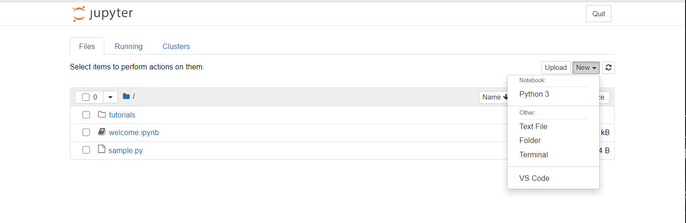
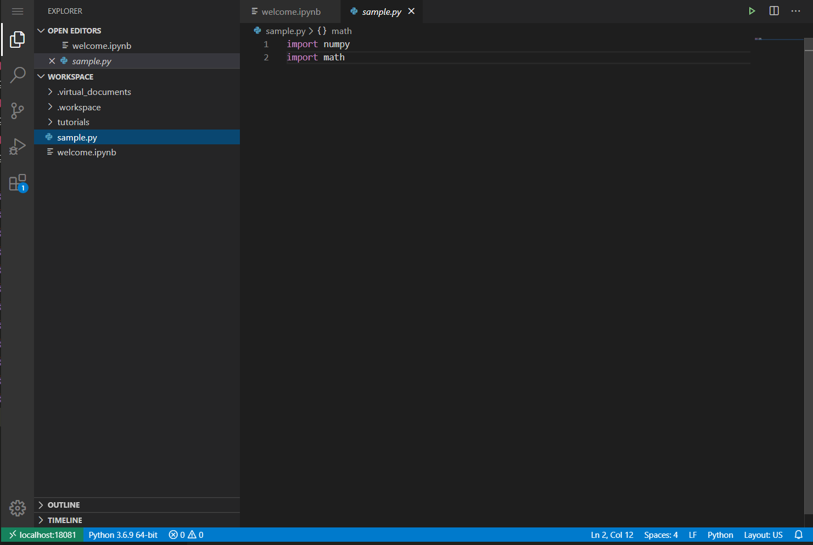
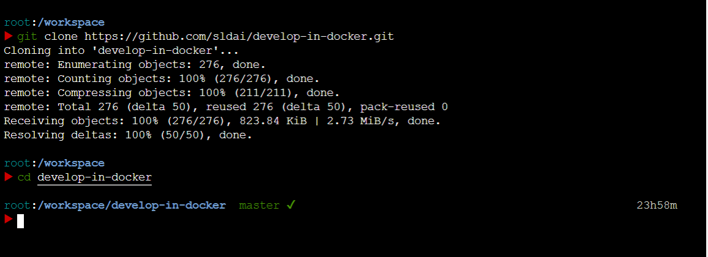

# Develop in docker

<!-- If you get tired of configuring development environment and dislike your pure system being contaminated by these configurations, you should try docker. Docker provides containerized environment, like but better conda.  -->

This repository contains the docker images I used for development. Then you can develop in the well configured environments with a web based IDE.  

## Getting Started

### Prerequisites

Install [docker](https://docs.docker.com/engine/install/ubuntu/) and [docker-compose](https://docs.docker.com/compose/install/)

### Running the images

```
git clone https://github.com/sldai/develop-in-docker.git
cd develop-in-docker
# specify the binding ports
export ideport=8080 developmentport=8081 
# specify your working directory
export workspace=$PWD
docker-compose up -d
```

### Developing with the web based IDE

You can get into the containers via `localhost:8080` and `localhost:8081`

jupyter



vscode



zsh




## Reference 

[ml-workspace](https://github.com/ml-tooling/ml-workspace)

[code-server](https://github.com/cdr/code-server)